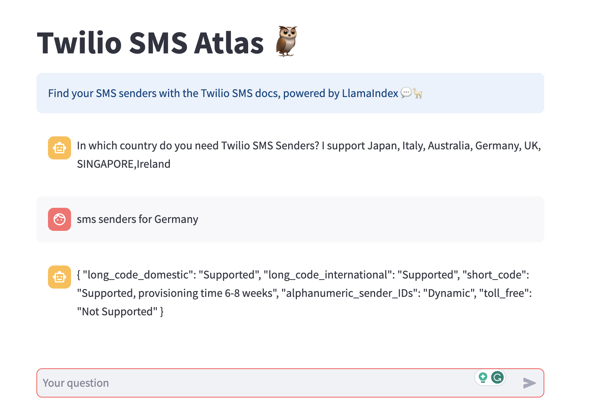

# 🦙📚 Twilio SMS Atlas - Chat with the Twilio SMS docs

Build a chatbot powered by LlamaIndex that augments GPT 3.5 with the content of the Twilio SMS docs.

## Overview of the App



- Takes user queries via Streamlit's `st.chat_input` and displays both user queries and model responses with `st.chat_message`
- Uses LlamaIndex to load and index data and create a chat engine that will retrieve context from that data to respond to each user query

## Demo App

[](https://twilio-sms-atlas.streamlit.app/)

## How to use the App

### 1. Configure app secrets
Create a `secrets.toml` file with the following contents.
- You can add secrets while developing locally. To do this, add a file called secrets.toml in a folder called .streamlit at the root of your app repo and paste your secrets into that file.
```
openai_key = "<your OpenAI API key here>"
```

### 2. Install dependencies
#### 2.1 Local Development
If you're working on your local machine, install dependencies using pip:
```
pip install streamlit openai llama-index nltk
```
#### 2.2 Cloud development
If you're planning to deploy this app on Streamlit Community Cloud, create a requirements.txt file with the following contents:
```
streamlit
openai
llama-index
nltk
```

### 3. Run the app
To run the app locally, use following command in the app route:
```
streamlit run app.py
```

## Get an OpenAI API key

You can get your own OpenAI API key by following the following instructions:
1. Go to https://platform.openai.com/account/api-keys.
2. Click on the `+ Create new secret key` button.
3. Next, enter an identifier name (optional) and click on the `Create secret key` button.

## Try out the app

Once the app is loaded, enter your question about Twilio SMS senders for supported country.
